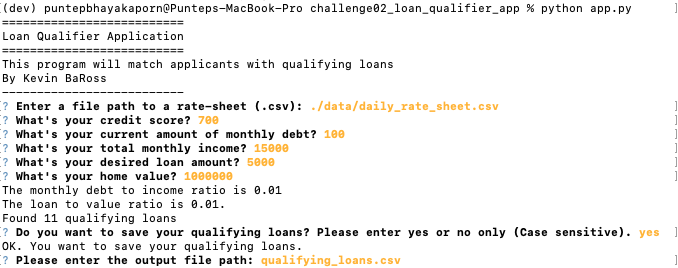
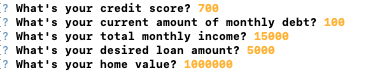
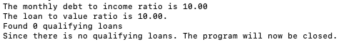
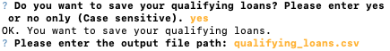
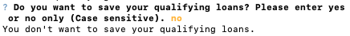

# Loan Qualifier App

This is the command-line interface application run on Python.
This program allows users to see which loan(s) they are qualified based on their financial information, such as their credit score, their monthly debt, their monthly income, their desired loan amount, and their home value. 

After the users input their financial information, the system will filter out the loan from a 'daily_rate_sheet' to show the users which loan(s) matches their financial profile.

---

## Technologies

This program uses python 3.7 with the 'fire' and 'questionary' packages.

---

## Installation Guide

Prior to start using the program, the user has to install **fire** and **questionary** by typing the following command into Terminal App (if they are Mac users) or Git Bash (if they are Windows users)

```python
    pip install fire
    pip install questionary
```

---
## Usage

The user has to clone the repository and run the **app.py** to use the loan qualifier app.

To run the **app.py**, runs the following command in Terminal app or Git Bash
```python
    python app.py
```
After that, the following prompts will be shown.



**Step 1**

The user has to enter the file path to get to the rate-sheet file. In this case, the user has to input `./data/daily_rate_sheet.csv`

If the correct file is input, the system will prompt the users with questions to gather financial information from users.


If the file does not exist, the following error message will be shown.


**Step 2**

The system will ask 5 questions to gather different financial information from users, which are credit score, monthly debt, monthly income, desired loan amount, and home value. 



It is important that the users put in only positive numerical value, otherwise the users will not get an accurate output from the system.

**Step 3**

Users will be able to see their monthly debt to income ratio and their loan to value ratio.

The system will then filter the loan out for the users. In this case, the system found 11 loans that match user's financial profile.


If there is no loan match the user's financial profile, the system will notify the user and the program will be closed.



**Step 4**

The users will be ask whether they want to save their loan results in the separate csv file.

If the user type `yes`, the system will prompt the user to enter the output path (or name of the file the user wants to save the result as). In this case the user wants to save the file as `qualifying_loans.csv`.



If words other than `yes` is entered, the filtered result will not be saved and the program will be closed.



---
## Contributors

Brought to you by: ET Home Loans

Initial code is provided by: UC Berkeley Fintech Bootcamp

Code is modified by: Kevin BaRoss [[LinkedIn](https://www.linkedin.com/in/kevin-baross/)]


---
## License
MIT